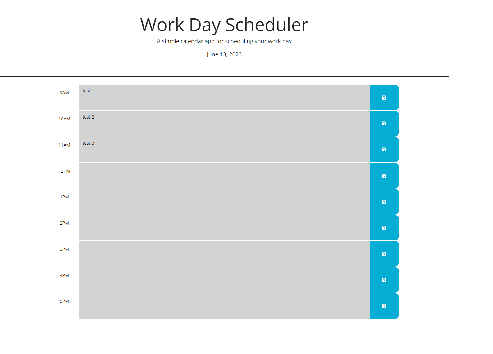

# Third Party Api Planner
In this project I have completed the planner by adding time blocks to the average everyday work schedule. It will not only tell you the day but also keeps track of the time and color coding the time blocks so you know where you are at in the day. It also saves you inputs to the local storage so if you hapopen to leave the page and return you items will still be on the page.

## Image of live page
---

---

## Live page 

## Special Thanks
Amir  
Shawn  
Stack Overflow   
Google   
MDN Docs   